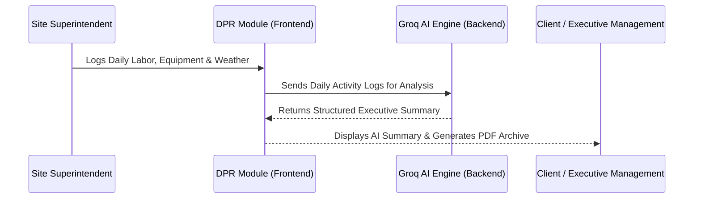
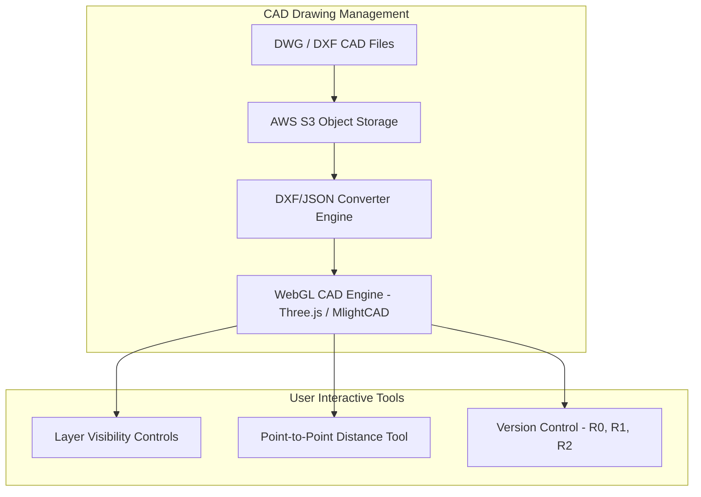
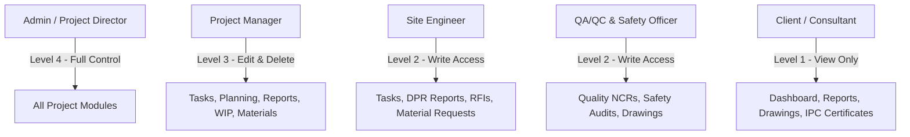

# MANO ERP: Project Execution & Engineering Management System

MANO ERP provides a comprehensive, domain-specific project management environment for civil engineering, commercial construction, infrastructure development, and industrial plant execution. Every project workspace consolidates 14 specialized engineering sub-modules to manage field operations, technical drawings, schedules, materials, subcontracts, quality, safety, and financial valuations.

---

## High-Level Project Architecture

```mermaid
graph TD
    subgraph Project Workspace Environment
        A[Project Dashboard & KPI Engine] --> B[Schedule & WBS Engine]
        A --> C[Technical Drawings & CAD Viewer]
        A --> D[Engineering Planning & Histograms]
        A --> E[Quality & Safety Governance]
        A --> F[Contracts & Milestone Billing]
        A --> G[Material Supply Chain & Allocation]
    end

    subgraph Operational Execution Layer
        B --> Tasks[Task Hierarchy & Dependencies]
        B --> WIP[Work in Progress Physical Valuation]
        B --> Phases[Milestone Phase Control]

        C --> CAD[In-Browser DWG/DXF Render Engine]
        C --> Layers[Layer Toggles & Point Measurement]

        D --> Gantt[Interactive Gantt Planning Chart]
        D --> ManHist[Manpower Histogram Forecasting]
        D --> MatHist[Material Demand Spikes]
        D --> Hindrance[Site Hindrance & Claim Logs]

        E --> NCR[Non-Conformance Reports - CAR]
        E --> Safety[Safety Incident & PPE Audits]
        E --> DPR[Daily Progress Reports & AI Insights]

        F --> Subcontracts[Vendor Subcontract Agreements]
        F --> Cert[Interim Payment Certificates - IPA]

        G --> MRR[Material Requisition Requests]
        G --> GRN[Goods Received Notes & Site Balances]
    end
```

---

## Detailed Breakdown of Project Modules & Industry Use Cases

### 1. Project Dashboard & Executive KPI Engine
- Architectural Features:
  - Real-time project overview displaying total tasks, critical path health, overall physical progress percentage, Schedule Performance Index (SPI), and Cost Performance Index (CPI).
  - High-risk hindrance alerts, recent activity audit stream, phase completion meters, and pending approval notifications.
- Industry Use Case:
  - Project Directors and Client Representatives review the dashboard to quickly gauge overall project health, identify operational bottlenecks, and monitor budget vs. actual progress without drilling into granular logs.

### 2. Work Breakdown Structure (WBS) & Task Management
- Architectural Features:
  - Multi-level hierarchical Task tree (WBS) supporting parent-child task grouping.
  - Task progress tracking (0% to 100%), planned vs. actual start and completion dates, milestone demarcation, task assignment to engineers/subcontractors, and dependency linking.
- Industry Use Case:
  - Site Engineers break down complex construction packages (e.g., "Piling & Excavation") into concrete site tasks (e.g., "Borehole Drilling", "Reinforcement Cage Placement", "Concrete Pouring"), tracking real-time status as site work progresses.

### 3. Work In Progress (WIP) & Physical Progress Valuation
- Architectural Features:
  - Bill of Quantities (BOQ) line item tracking against actual physical execution.
  - Physical progress percentage calculation, executed quantity verification, unit rate costing, and earned value management (EVM).
- Industry Use Case:
  - Quantity Surveyors (QS) measure executed site quantities (e.g., cubic meters of concrete poured or metric tons of structural steel erected) against contract BOQ targets to compute monthly physical progress valuations.

### 4. Field Reports, Daily Progress Logs & AI Summarization
- Sub-Features & Components:
  - Daily Progress Reports (DPR): Captures site workforce counts by trade, machinery/equipment deployment logs, weather conditions (rain, temperature), and work accomplished per zone.
  - AI Executive Insights (Groq SDK): Automatically analyzes multi-day DPR entries to generate structured, human-readable executive summaries highlighting progress, delays, and site shortages.
  - Weekly Summaries & Monthly Archives: Aggregates progress into formal weekly reports and generates historical PDF book archives and presentation slide decks (PPT Editor).
  - Minutes of Meetings (MoM): Manages formal site meeting agendas, attendee registers, action item assignments, and resolution deadlines.
  - Team Contribution Audits: Logs individual engineer updates and task completions for auditability.
- Industry Use Case:
  - Site Superintendents input daily labor, machinery, and weather notes. The Groq AI engine synthesizes raw site entries into formal progress summaries for executive stakeholders, reducing daily reporting overhead.

### 5. General Documents, Organisation & Staff Allocation
- Sub-Features & Components:
  - Interactive Site Organisation Chart: Visual tree mapping project leadership, site engineers, QA/QC leads, and safety officers with escalation chains.
  - Staff Roles & Allocation: Personnel assignment module for assigning staff members to specific project roles.
  - Project Vendor List: Subcontractors and material suppliers assigned specifically to the project.
  - Document Directory: File tree manager for storing technical submittals, permits, land approvals, and cycle attachments.
- Industry Use Case:
  - Project Managers define the site organizational hierarchy and assign clear responsibilities, ensuring subcontractors and staff follow defined escalation paths for site issues.

### 6. Technical Drawings & Web-Native CAD/DXF Viewer
- Architectural Features:
  - WebGL-powered 2D/3D CAD viewer utilizing Three.js and `@mlightcad` engines for rendering DWG and DXF technical drawings directly in the browser.
  - Drawing Revision Management: Maintains drawing versions (R0, R1, R2...) with change tracking and release dates.
  - Layer Control & Inspection: Toggles visibility of drawing layers (e.g., structural steel, plumbing pipes, electrical conduits, HVAC ducting).
  - Measurement Tools: In-browser point-to-point distance measuring and dimensional verification.
  - Category Mapping: Categorizes drawings under Architectural, Structural, MEP (Mechanical, Electrical, Plumbing), Civil, and Landscape packages.
- Industry Use Case:
  - Field Construction Engineers inspect structural rebar details or plumbing alignments directly on mobile tablets on-site, measuring distances and verifying layer visibility without requiring desktop AutoCAD installations.

### 7. Comprehensive Engineering Planning & Analysis
- Sub-Features & Components:
  - Project Planning Bar Chart (Gantt View): Interactive baseline schedule timeline showing task phases, critical paths, and schedule variances.
  - Manpower Histogram: Forecasts daily workforce demand (masons, carpenters, steel fixers, electricians) across the project lifecycle.
  - Material Histogram: Models projected consumption spikes for major materials (cement, rebar, structural steel) to optimize procurement lead times.
  - Logistic Plan: Maps heavy equipment staging, mobile crane positioning, tower crane swing radiuses, material storage yards, and site access roads.
  - Hindrance Report Engine: Formally logs site obstacles (e.g., heavy rainfall, unexploded ordnance, utility line relocation delays, client design holds) with quantified financial and schedule impact metrics.
- Industry Use Case:
  - Planning Engineers model manpower curves to ensure labor subcontracts are awarded before peak construction demand. When site work is blocked by external utility delays, engineers log Hindrance Reports to support contractual extension-of-time (EOT) claims.

### 8. Project Phase Milestones
- Architectural Features:
  - Structured phase lifecycle tracking (e.g., Enabling Works, Foundation & Substructure, Superstructure, MEP Rough-Ins, Internal Finishes, Testing & Commissioning, Handover).
  - Planned vs. actual phase completion dates and gate-approval milestones.
- Industry Use Case:
  - General Contractors track phase gate transitions to verify that foundation inspections are fully signed off before releasing work for superstructure framing.

### 9. Subcontracts & Commercial Contract Management
- Architectural Features:
  - Vendor Subcontract Management: Defines package scopes, contract lump-sum values, unit rates, retention percentages, and defect liability terms.
  - Contract Variations & Addendums: Formally logs scope changes, variation orders (VO), price escalations, and contractual claims.
- Industry Use Case:
  - Commercial Managers manage subcontractor agreements, ensuring that scope variations are approved before extra work is executed on-site.

### 10. Quality Assurance & Non-Conformance Management (QA/QC)
- Architectural Features:
  - Quality Inspection Checklists: Pre-pour inspection forms, soil compaction tests, welding inspection logs, and waterproofing sign-offs.
  - Non-Conformance Reports (NCR): Formally records site construction defects, assigns Corrective Action Requests (CAR) to vendors, sets severity levels, and tracks reinspection approvals.
  - Request for Inspection (RFI): Manages formal inspection requests sent to client consultants.
- Industry Use Case:
  - QA/QC Inspectors issue an NCR when rebar spacing fails to match structural drawing specifications. The subcontractor must execute corrective work and pass a re-inspection before concrete pour clearance is granted.

### 11. Health, Safety & Environment (HSE)
- Architectural Features:
  - Site Safety Audit Checklists: Evaluates scaffolding stability, excavation shoring, electrical grounding, and crane rigging safety.
  - PPE Compliance Monitoring: Tracks hardhat, safety harness, and steel-toe boot compliance across trade teams.
  - Incident & Injury Logging: Records near-miss events, minor injuries, lost-time injuries (LTI), and hazard remediation plans.
- Industry Use Case:
  - HSE Officers conduct morning safety walks, logging near-miss hazards or un-shored trenches to enforce immediate site corrections and maintain zero-accident safety compliance.

### 12. Commercial Billing & Interim Payment Certificates (IPC)
- Architectural Features:
  - Milestone Billing & Payment Valuations: Computes interim payment applications based on physical progress.
  - Deduction Engine: Calculates retention money withholdings, advance mobilization recoveries, statutory tax deductions (GST/VAT), and penalty liquidated damages.
  - Payment Certificate Approval: Generates formal certified payment applications for client disbursement.
- Industry Use Case:
  - Finance Managers compile monthly Interim Payment Certificates (IPC), deducting 5% retention and 10% mobilization advance recovery from the gross progress valuation before issuing payment claims.

### 13. Site Material Supply Chain & Allocation Management
- Architectural Features:
  - Material Requisition Requests (MRR): Field engineers request materials from central inventory or project store.
  - Material Issue Slips (MIS) & Allocation: Tracks material dispatch to specific trade teams or physical site zones.
  - Goods Received Notes (GRN): Logs incoming vendor deliveries on-site, verifying delivery receipts against purchase orders and updating current stock balance.
- Industry Use Case:
  - Site Storekeepers issue Goods Received Notes (GRN) when rebar shipments arrive, update local project stock levels, and issue rebar quantities to structural sub-contractors via Material Issue Slips.

### 14. Governance & Multi-Tiered Approval Engine
- Architectural Features:
  - Multi-stage approval workflow engine for critical project transactions.
  - Pending approval queue for budget revisions, scope variations, major material requisitions, and contractual change orders.
- Industry Use Case:
  - Ensures that any site variation exceeding set financial limits requires sequential digital sign-offs from the Resident Engineer, Commercial Manager, and Project Director before execution.

---

## Project Permission & Access Control Matrix

